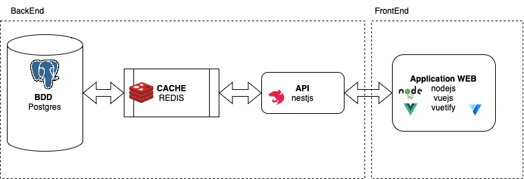
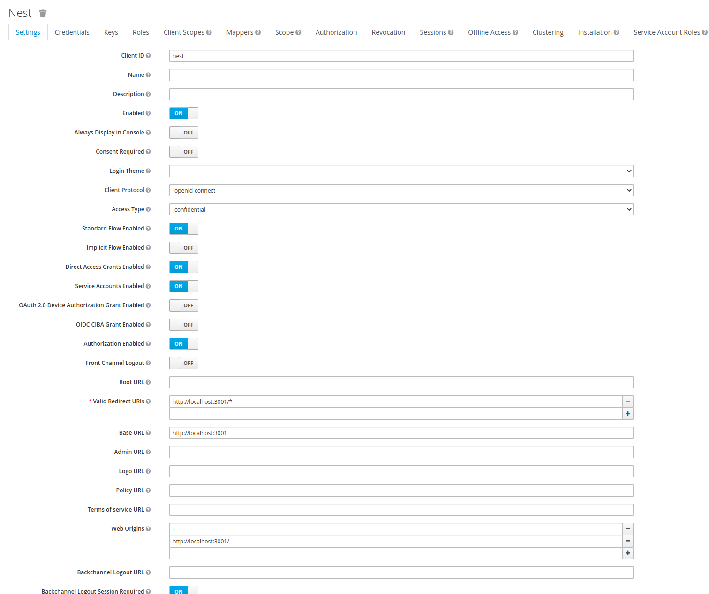
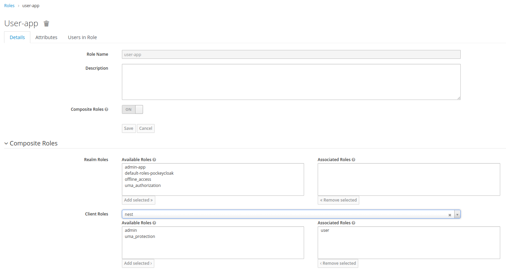
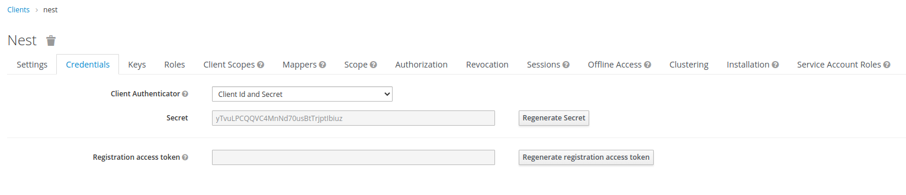
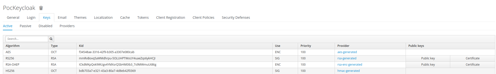

# la Stack

Docker + NestJS + Redis + Postgres (with Prisma)

[https://www.docker.com](https://www.docker.com) => Docker est une plateforme permettant de lancer certaines applications dans des conteneurs logiciels

[https://docs.nestjs.com](https://docs.nestjs.com) => Nest. js est l'un des frameworks Node pour construire des applications backend efficaces, évolutives et de niveau entreprise en utilisant Node. js (spring boot like)

[https://redis.io](https://redis.io) => Redis vient de Remote Dictionary Server. Ce type de serveur est idéal lorsqu'il est utilisé comme mémoire de données rapide. (cache pour postgres)

[https://www.postgresql.org](https://www.postgresql.org) => PostgreSQL est un système de gestion de base de données relationnelle et objet. C'est un outil libre disponible selon les termes d'une licence de type BSD.

[https://www.prisma.io](https://www.prisma.io) => Prisma : un [ORM](#orm) de nouvelle génération pour Node.js et TypeScript

ici juste le backEnd. le Frontend conseiller avec ce back mais tout autre front peux convenir.


# Développement en Local

Comment lancer ce projet en local.

1. Cloner le repo
2. Lancer `npm run install` pour installer les dependencies
3. Cpoier le `.env.example` en `.env` et mettre aà jour les variables
4. Lancer `docker-compose up -d` pour configurer l'environnement local avec Docker
5. Run `npx prisma migrate dev` pour exécuter des migrations de bases de données locales

Cette configuration gérera le rechargement à chaud, de sorte que toutes les mises à jour que vous apportez au code NestJS mettront à jour le conteneur en temps réel.

## Installation de nouveaux packages / modifications de la base de données

Si vous installez de nouvelles dépendances ou apportez des modifications à la base de données, vous devrez exécuter les commandes suivantes pour vous assurer que vos conteneurs Docker utilisent également les nouvelles dépendances :

```bash
docker-compose down
```

Et puis exécutez la commande :

```bash
docker-compose up -d --build -V
```

## Autre commande en vrac

Mise à jour du code typescript des repository

```bash
npm run prisma:generate
```

Mise à jour des tables en BDD depuis les définition du fichier schema.prisma

```bash
npm run prisma:migrate
```

L'openAPI est ici [http://localhost:3000/api](http://localhost:3000/api)

# Annexe

<a name="orm"></a>Un mapping objet-relationnel (en anglais object-relational mapping ou ORM) est un type de programme informatique qui se place en interface entre un programme applicatif et une base de données relationnelle pour simuler une base de données orientée objet. Ce programme définit des correspondances entre les schémas de la base de données et les classes du programme applicatif. On pourrait le désigner par là, « comme une couche d'abstraction entre le monde objet et monde relationnel ». Du fait de sa fonction, on retrouve ce type de programme dans un grand nombre de frameworks sous la forme de composant ORM qui a été soit développé, soit intégré depuis une solution externe.


# Keycloak 

La console d'administration du keycloak se situe a l'adresse suivante [http://localhost:8083/auth/](http://localhost:8083/auth/) 

Sur cette console il faudra: 
- créer un Realm.
- Ensuite, il faudra aller dans l'onglet clients pour ensuite créer un client pour votre l'application, Pour le backend n'oubliez pas l'Access Type en confidentiel ou Bearer-only


- Il faut ensuite créer des roles pour vos utilisateurs. Il est possible de créer des roles dans pour le Realm est de les associer a des rôles present dans les clients avec Composite Role.


- Ensuite créer vos utilisateurs puis affectés les aux rôles souhaités avec l'onglet Role Mapping.


## Ou récupérer les informations pour le backend 

- <u>**Url**</u> : http://localhost:{{port}}/auth
- <u>**Realm**</u>: Le nom du realm que vous avez créé au début 
- <u>**ClientId**</u>: c'est le nom du client que vous avez créé précédemment
- <u>**ClientSecret**</u>: il faut aller dans l'onglet Credential (non visible en mode public) de votre client 
- <u>**RealmPublicKey**</u>: Il faut aller dans l'onglet RealmSetting puis dans l'onglet keys 


